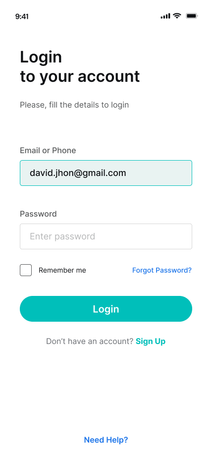
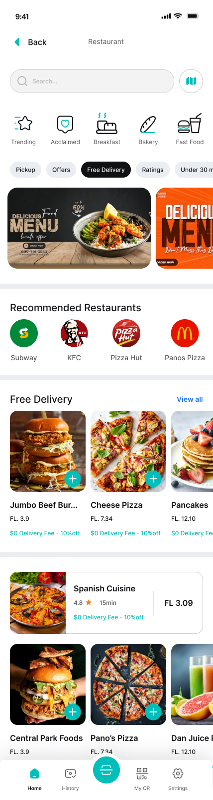
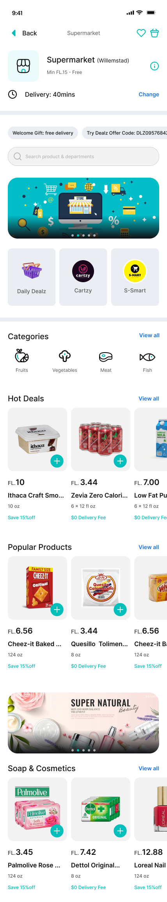
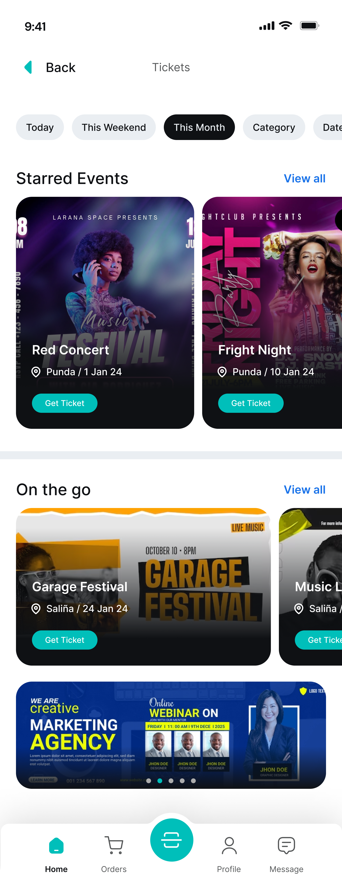
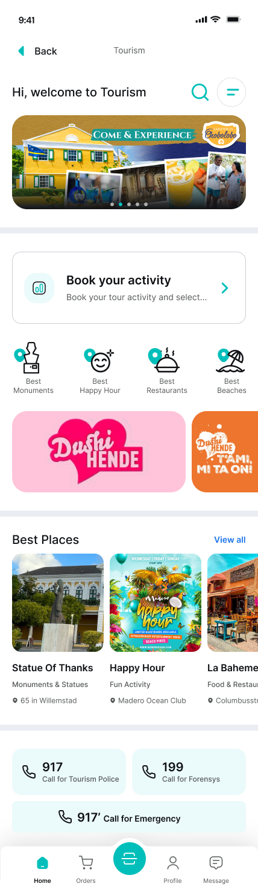
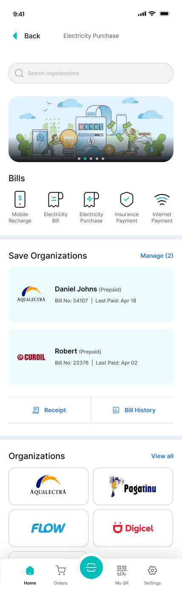

# Dealz_UI
E-commerce, Tourism, Events, Ticket booking, Pay bills, Food Delivery, medical- All in one App with Rest API &amp; Firebase

## Screenshots

Here are some screenshots of the app to give you a sneak peek of its design and functionality:

### App Screenshots

    <table>
        <tr>
            <td valign="top"></td>
            <td valign="top"></td>
            <td valign="top"></td>
          <td valign="top"></td>
            <td valign="top"></td>
            <td valign="top"></td>
        </tr>
        <tr>
<!--             <td><em>Sign In Screen</em></td>
            <td><em>Settings Page</em></td>
            <td><em>User Profile</em></td> -->
        </tr>
    </table>

